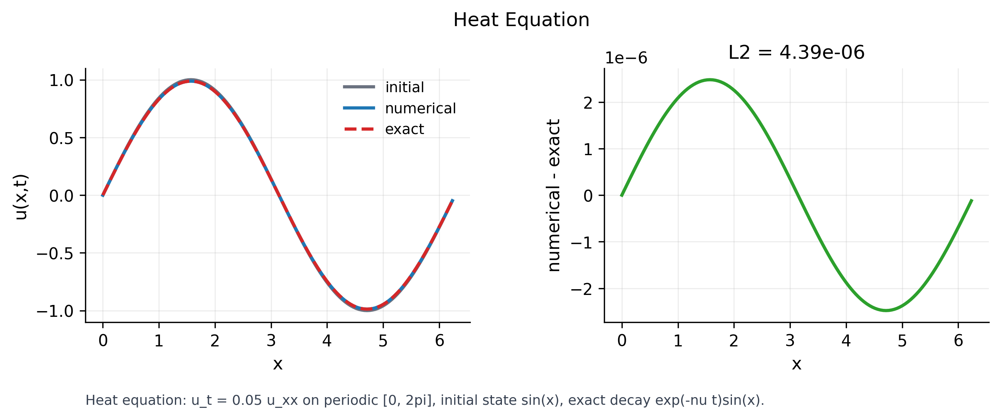
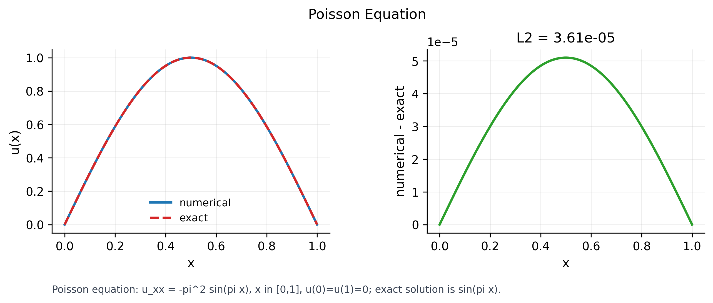
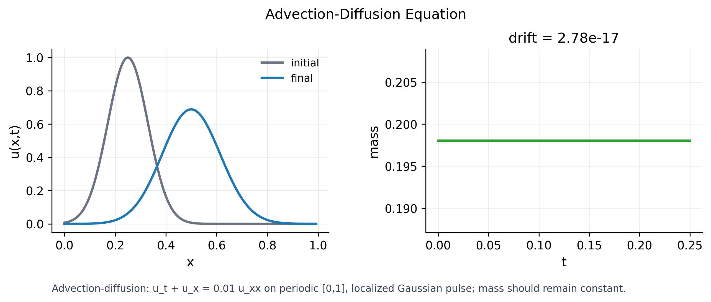

# Numerical PDE Solvers

A compact Python collection of reusable numerical methods for PDE experiments.

## Features

- Generic 1D grid, boundary, operator, time-stepping, and analysis utilities
- Finite-difference, WENO-style, and spectral derivative operators
- Burgers equation examples kept outside the core package

## Install

```bash
cd python
pip install -e ".[dev]"
```

## Quick Start

```python
import numpy as np
from numerical_pde import ExplicitPDESolver, Grid1D, central_second, upwind_first

grid = Grid1D(0.0, 2.0 * np.pi, 128)
nu = 0.01
u0 = np.sin(grid.x)

def rhs(u, dx, time):
    return -u * upwind_first(u, dx) + nu * central_second(u, dx)

solver = ExplicitPDESolver(grid=grid, rhs=rhs, viscosity=nu)
result = solver.solve(u0, final_time=0.5)
```

## Layout

```text
python/src/numerical_pde/   reusable methods
python/examples/            concrete PDE cases
tests/                      smoke and correctness tests
```

## Canonical Figures

These cases show what each numerical method should preserve or approximate.

### Heat: diffusion with exact decay



The numerical solution is compared with the analytic sine-mode decay. The error panel should remain small and structured.

### Poisson: boundary-value problem



The solver recovers the exact solution under Dirichlet boundary conditions. The right panel shows pointwise numerical error.

### Advection-Diffusion: transport plus smoothing



The pulse moves and broadens. The mass panel checks whether the discretization preserves the total amount of the transported quantity.

## Run Examples

```bash
cd python
python examples/burgers_fdm.py
python examples/burgers_weno.py
python examples/canonical_cases.py heat
python examples/canonical_cases.py poisson
python examples/canonical_cases.py advection_diffusion
```

Generated figures are saved under `outputs/`, which is ignored by Git. Use `--formats png pdf svg` to choose formats.

## Tests

```bash
pytest
```

## Adding A PDE

Put reusable discretization mechanics in `python/src/numerical_pde`. Keep equation setup, parameters, initial conditions, and plotting in examples.
